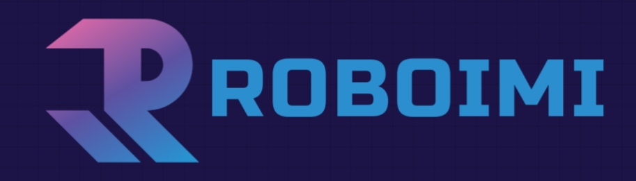

Overview
=========



本框架主要用于机械臂的深度强化学习训练与运动/动力学控制算法验证

我们提供：  
* 多种控制方案
* 高精度控制过程
* 深度强化学习环境

目前主要完成了：
  1. 底层关节位置/扭矩控制器  
     * 使用 Ruckig 规划关节位置、速度、加速度，实现平滑运动  
     * 基于 pd 控制与动力学计算扭矩  

  2. 中间笛卡尔位置控制器  
     * 基于 pd 控制与运动学实现笛卡尔空间下的位置/旋转控制  
  
  3. 上层轨迹规划器  
     * 对目标位置/旋转进行离散  

  4. 框架优点  
     * 具有更高的运动精度，更符合真实环境中的运动  
     * 高度可移植性，更抽象，更简洁  
     * 更丰富的任务环境， 如柔顺控制，动作模仿，视觉私服等
     * 可以接入 gym 环境，进行强化学习


---
# Installation  
---
## Environments

* Ubuntu 20.04
* MuJoCo-2.3.2

---

## Build From Source

1. 项目部署：

   ```commandline
   $ git clone https://gitee.com/usst-imi/roboIMI.git
   $ cd roboIMI
   $ pip3 install -r requirements.txt
   ```
2. PyKDL部署：
   https://github.com/orocos/orocos_kinematics_dynamics  
   如果是conda环境，可能会出现冲突问题，解决方法如下：
   https://blog.csdn.net/qq_43557907/article/details/127818837

---

## Demos
Note: 如果你是 Vscode 编辑器，那么在运行所有代码时请在 roboIMI 目录下进行，如：
```commandline
/home/xxx/roboIMI$ python env/single_base.py
```
### demo_admit_rl

导纳控制

---

